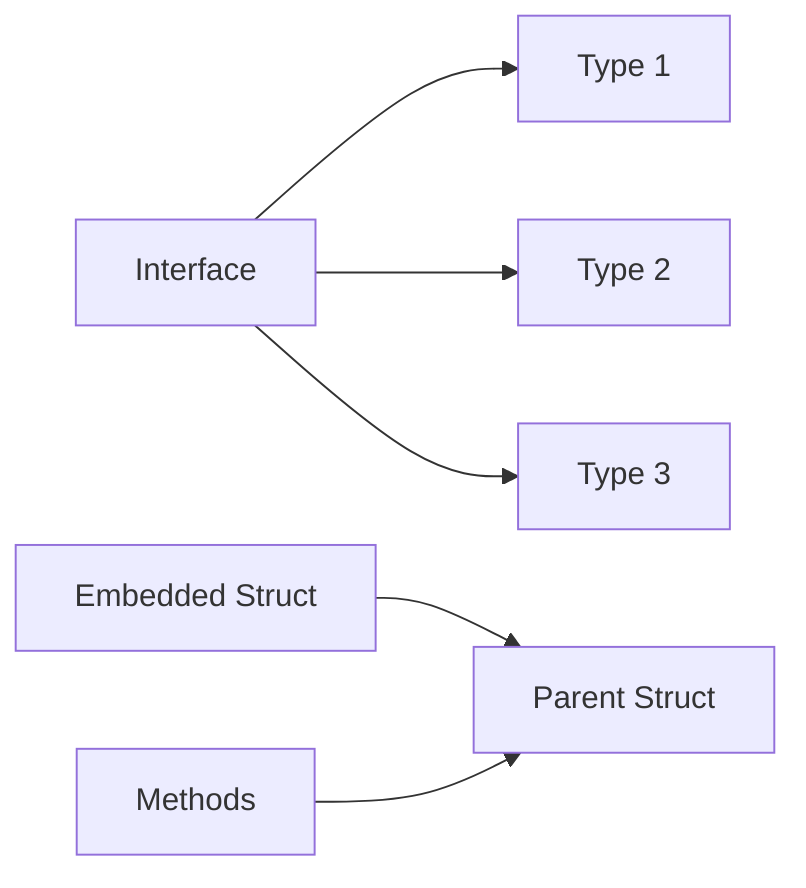
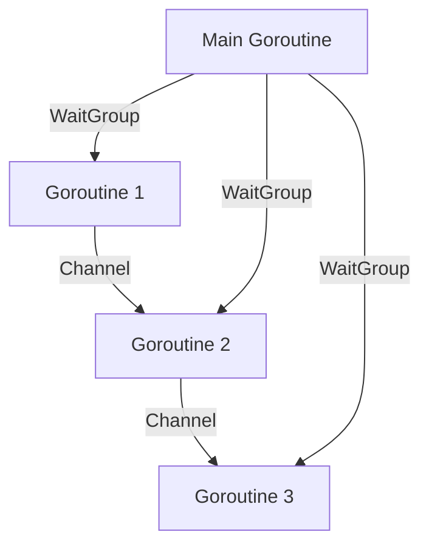
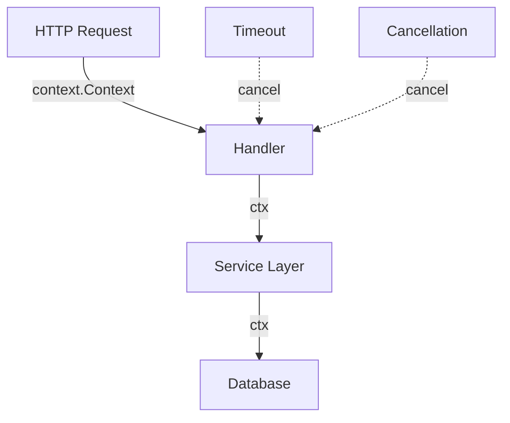
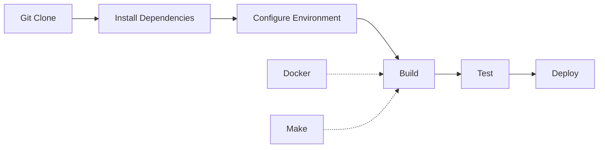
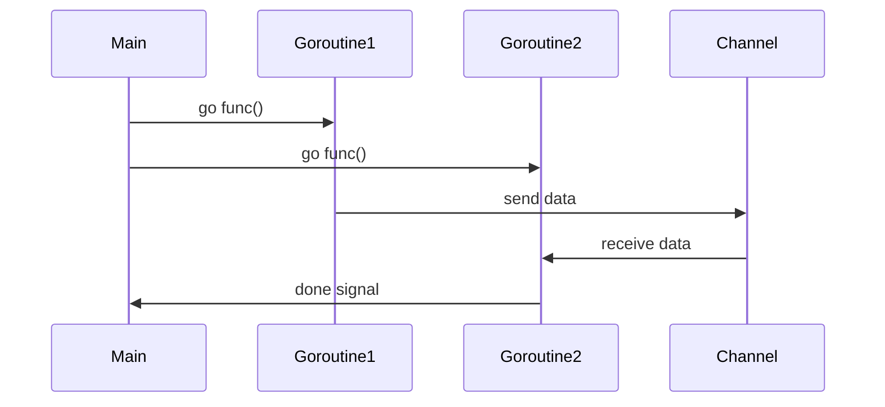
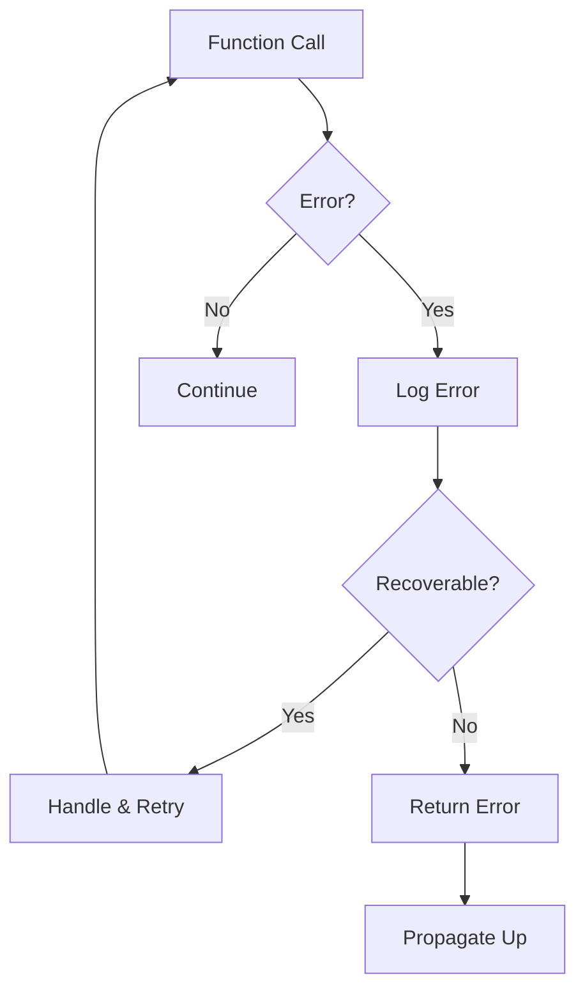
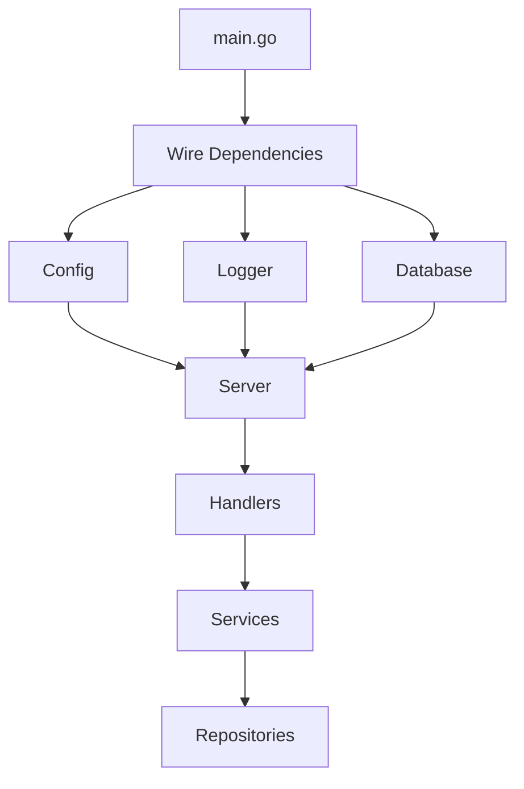
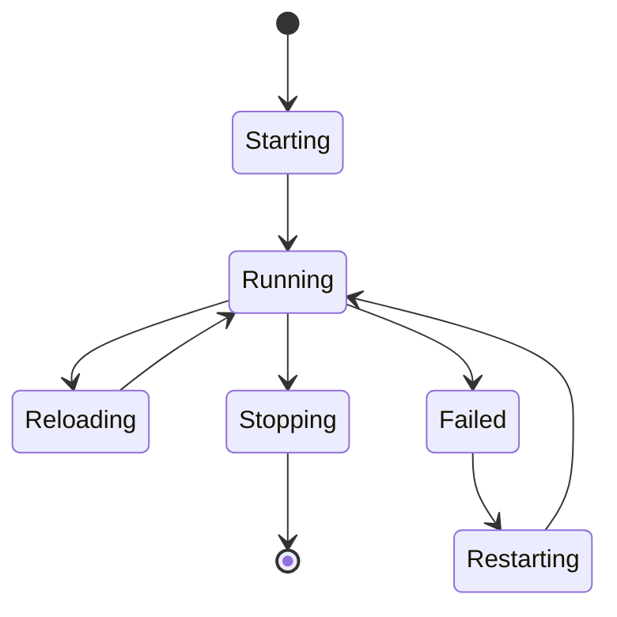
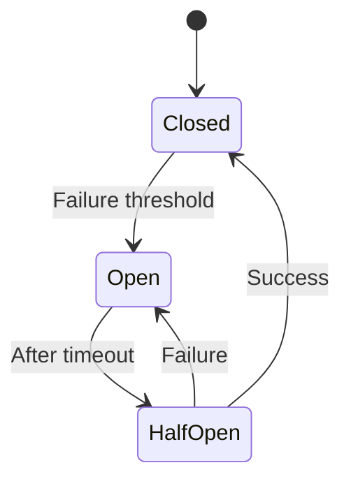
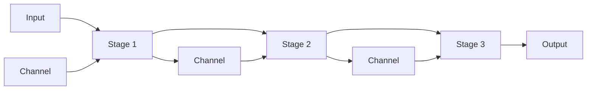

# Golang & Linux Project Cheat Sheet

## Table of Contents
1. [Go Mental Models](#go-mental-models)
2. [Go Project Structure](#go-project-structure)
3. [Go Idiomatic Patterns](#go-idiomatic-patterns)
4. [Linux Development Workflow](#linux-development-workflow)
5. [Common Commands](#common-commands)
6. [Visual Diagrams](#visual-diagrams)

---

## Go Mental Models

### 1. Composition Over Inheritance


### 2. Concurrency Model


### 3. Error Handling Flow
```go
// Idiomatic error handling
if err != nil {
    return fmt.Errorf("operation failed: %w", err)
}
```

---

## Go Project Structure

```
myproject/
├── cmd/                    # Main applications
│   └── myapp/
│       └── main.go
├── internal/              # Private application code
│   ├── config/
│   ├── handler/
│   └── service/
├── pkg/                   # Public libraries
│   └── utils/
├── api/                   # API definitions
│   └── openapi.yaml
├── build/                 # Packaging and CI
│   └── Dockerfile
├── scripts/              # Build/install scripts
├── test/                 # Additional test apps
├── vendor/              # Dependencies (optional)
├── go.mod
├── go.sum
├── Makefile
└── README.md
```

---

## Go Idiomatic Patterns

### Interface Design
```go
// Small interfaces are idiomatic
type Reader interface {
    Read([]byte) (int, error)
}

// Accept interfaces, return concrete types
func ProcessData(r Reader) (*Result, error) {
    // implementation
}
```

### Constructor Pattern
```go
// Use functional options for flexible initialization
type Option func(*Server)

func WithPort(port int) Option {
    return func(s *Server) {
        s.port = port
    }
}

func NewServer(opts ...Option) *Server {
    s := &Server{
        port: 8080, // default
    }
    for _, opt := range opts {
        opt(s)
    }
    return s
}
```

### Context Usage


---

## Linux Development Workflow

### Development Environment Setup


### File Permissions Mental Model
```
Owner  Group  Others
rwx    rwx    rwx
421    421    421

7 = rwx (read, write, execute)
6 = rw- (read, write)
5 = r-x (read, execute)
4 = r-- (read only)
```

---

## Common Commands

### Go Commands
```bash
# Module management
go mod init github.com/user/project
go mod tidy
go mod vendor
go mod download

# Building
go build -o bin/myapp ./cmd/myapp
go build -ldflags="-s -w" ./...  # Strip debug info
go build -race ./...              # Race detector

# Testing
go test ./...
go test -v -cover ./...
go test -bench=. ./...
go test -race ./...

# Tools
go fmt ./...
go vet ./...
go generate ./...
golangci-lint run

# Debugging
dlv debug ./cmd/myapp
go tool pprof cpu.prof
```

### Linux Project Commands
```bash
# Project setup
mkdir -p {cmd,internal,pkg,api,build,scripts,test}
touch Makefile README.md .gitignore

# Git workflow
git init
git add .
git commit -m "Initial commit"
git push -u origin main

# Environment
export GOPROXY=https://proxy.golang.org
export GO111MODULE=on
export CGO_ENABLED=0

# Process management
ps aux | grep myapp
kill -TERM <pid>
killall myapp

# System monitoring
htop
iostat -x 1
netstat -tulpn
lsof -i :8080

# Logs
journalctl -u myapp -f
tail -f /var/log/myapp.log
```

### Makefile Template
```makefile
.PHONY: build test clean run

BINARY_NAME=myapp
BINARY_PATH=bin/$(BINARY_NAME)

build:
	@echo "Building..."
	go build -o $(BINARY_PATH) ./cmd/myapp

test:
	@echo "Testing..."
	go test -v ./...

clean:
	@echo "Cleaning..."
	go clean
	rm -f $(BINARY_PATH)

run: build
	@echo "Running..."
	./$(BINARY_PATH)

docker:
	docker build -t myapp:latest .
	
lint:
	golangci-lint run

.DEFAULT_GOAL := build
```

---

## Visual Diagrams

### Go Execution Flow


### Error Handling Pattern


### Dependency Injection Flow


### Linux Service Lifecycle


---

## Best Practices

### Go Best Practices
1. **Keep interfaces small** - Prefer many small interfaces over large ones
2. **Error wrapping** - Use `fmt.Errorf` with `%w` for error context
3. **Context first** - Pass context as the first parameter
4. **Defer cleanup** - Use defer for cleanup operations
5. **Table-driven tests** - Use test tables for multiple scenarios

### Linux Best Practices
1. **Use systemd** for service management
2. **Log to stdout/stderr** - Let systemd handle log routing
3. **Handle signals gracefully** - Implement SIGTERM handling
4. **Use environment variables** for configuration
5. **Follow FHS** - Filesystem Hierarchy Standard

### Security Checklist
- [ ] No hardcoded credentials
- [ ] Use HTTPS/TLS
- [ ] Validate all inputs
- [ ] Use prepared statements for SQL
- [ ] Run as non-root user
- [ ] Set appropriate file permissions
- [ ] Use secrets management system

---

## Common Patterns

### Worker Pool Pattern
```go
func workerPool(jobs <-chan Job, results chan<- Result) {
    var wg sync.WaitGroup
    for i := 0; i < numWorkers; i++ {
        wg.Add(1)
        go worker(jobs, results, &wg)
    }
    wg.Wait()
    close(results)
}
```

### Circuit Breaker Pattern


### Pipeline Pattern


---

## Debugging Tips

### Go Debugging
```bash
# Race detector
go run -race main.go

# Memory profiling
go test -memprofile=mem.prof
go tool pprof mem.prof

# CPU profiling
go test -cpuprofile=cpu.prof
go tool pprof cpu.prof

# Trace
go test -trace=trace.out
go tool trace trace.out
```

### Linux Debugging
```bash
# Strace - system calls
strace -p <pid>

# GDB for Go
gdb ./myapp
(gdb) break main.main
(gdb) run

# Core dumps
ulimit -c unlimited
gdb ./myapp core

# Network debugging
tcpdump -i any port 8080
wireshark
```

---

## Quick Reference

### Environment Variables
```bash
# Go specific
GOOS=linux
GOARCH=amd64
GOPROXY=https://proxy.golang.org
GOPRIVATE=github.com/mycompany/*
GOPATH=$HOME/go
GOBIN=$GOPATH/bin

# Application specific
APP_ENV=production
APP_PORT=8080
APP_LOG_LEVEL=info
DATABASE_URL=postgres://...
```

### Signal Handling
```go
sigChan := make(chan os.Signal, 1)
signal.Notify(sigChan, syscall.SIGINT, syscall.SIGTERM)

go func() {
    <-sigChan
    // Graceful shutdown
    ctx, cancel := context.WithTimeout(context.Background(), 30*time.Second)
    defer cancel()
    server.Shutdown(ctx)
}()
```

---

## Resources

- [Effective Go](https://golang.org/doc/effective_go)
- [Go Code Review Comments](https://github.com/golang/go/wiki/CodeReviewComments)
- [Linux Documentation Project](https://tldp.org/)
- [The Linux Command Line](http://linuxcommand.org/)
- [Go Proverbs](https://go-proverbs.github.io/)